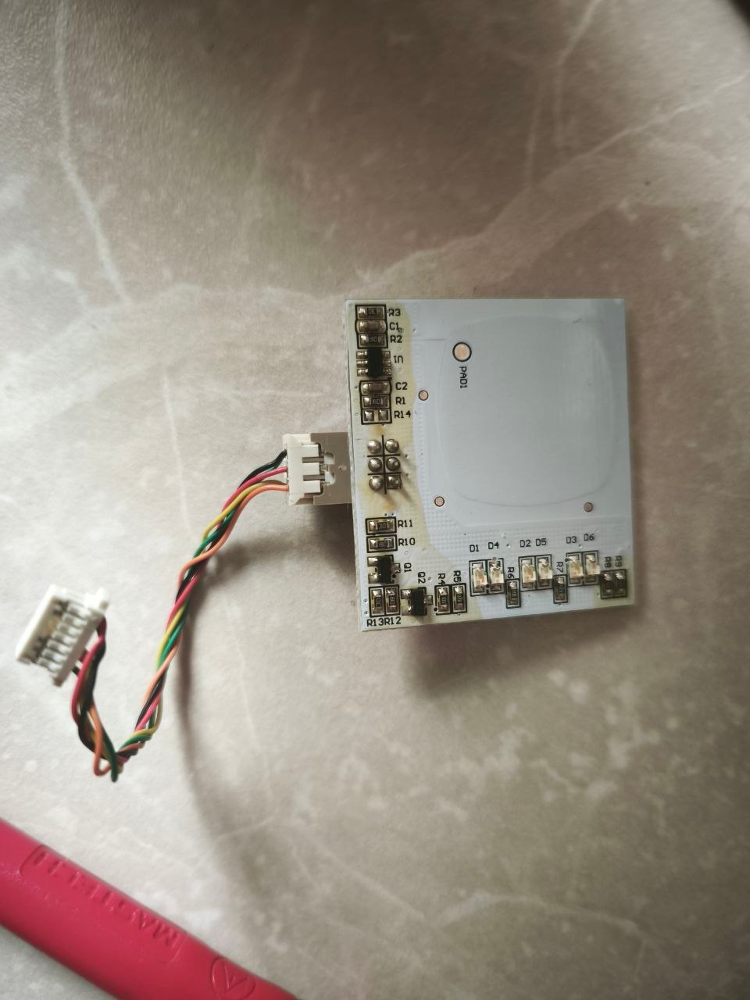
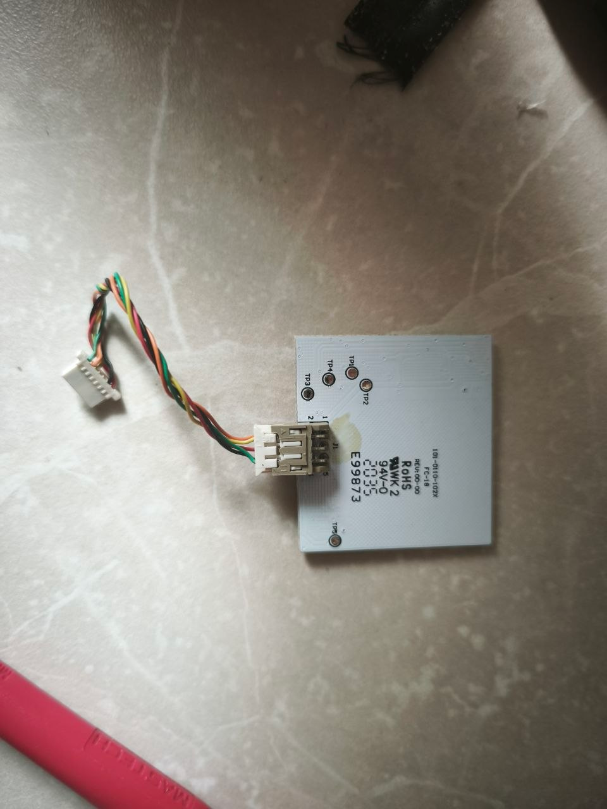

# RGB Touch Button Harness

Observed by Victor after disassembling the button.  The main-board connector
is recorded as `J12` following the current project naming; confirm its
silkscreen reference before using that name on a schematic.

## Button-side connector (six positions)

| Button-side pin | Harness wire | Main-board connector pin | Notes |
| --- | --- | --- | --- |
| 1 | yellow | 5 | through connection |
| 2 | orange | 6 | through connection |
| 3 | not populated | none | no wire |
| 4 | red | 1 | through connection |
| 5 | green | 7 | through connection |
| 6 | black | 2 | through connection |

## Main-board connector (seven positions)

| Board-side pin | Harness wire | Button-side pin |
| --- | --- | --- |
| 1 | red | 4 |
| 2 | black | 6 |
| 3 | not populated | none |
| 4 | not populated | none |
| 5 | yellow | 1 |
| 6 | orange | 2 |
| 7 | green | 5 |

Wire colours are physical harness colours only.  Their electrical roles
(power, touch signal, and LED channels) are not yet verified; do not drive a
line as an RGB channel solely from its wire colour.

## Photos

Component side:

Solder side:

## Visible board features

- The large rounded copper area is marked `PAD1`; it is the touch electrode.
- The board has six SMD LEDs labelled `D1` through `D6`, consistent with two
  emitters per backlight colour, although each LED colour still needs an
  optical or electrical check.
- Two SOT-23 transistors, `Q1` and `Q2`, and their nearby resistors appear to
  be the LED switching stages.  The active controller and passives are all on
  the component side; the solder side shows the routes and several test pads.
- The solder-side PCB identifier visibly reads `E99873`.  Other manufacturing
  text is not clear enough in the photo to treat as a part number.

## Touch controller and observed route

- Victor read the SOT-23-6 touch controller marking as `TCH223`, second line
  `BC2035` (likely a lot/date code).
- Power-off continuity observation: `PAD1` goes to `R2`; `R2` is connected to
  `C1`; `C1` goes to the physical second lead of the controller package.
- The black harness wire (`J12:2`, button-side pin 6) goes to `U1:2`.
- The red harness wire (`J12:1`, button-side pin 4) goes to `U1:5`.
- The green harness wire (`J12:7`, button-side pin 5) goes to `U1:1`.
- The orange harness wire (`J12:6`, button-side pin 2) goes to `R11`.
- The yellow harness wire (`J12:5`, button-side pin 1) goes to `R12`.
- The official Tontek `TTP223-BA6`/`TTP223N-BA6` datasheet is saved as
  [`datasheets/TCH223_TTP223-BA6_Tontek_touch_controller.pdf`](datasheets/TCH223_TTP223-BA6_Tontek_touch_controller.pdf).
  It is a reference for TTP223-style pin functions; the exact `TCH223` order
  code has not been confirmed.

If it is TTP223-BA6 compatible, its pin functions are: `1=Q` (CMOS touch
output), `2=VSS`, `3=I` (electrode input), `4=AHLB` (output polarity option),
`5=VDD`, `6=TOG` (direct/toggle option).  The observed *physical* second
lead must not be called datasheet pin 2 until the package pin-1 orientation
is established.  Confirm that lead against board ground first; a TTP223
compatible part would have `VSS` on datasheet pin 2.

The exact physical fact is `J12:2` black to `U1:2`.  Confirm it directly to
the board ground plane before naming it `VSS`/GND.

Main-board `J12:1` is confirmed as the 3.3 V rail and the red wire reaches
`U1:5`.  The TTP223 reference calls pin 5 `VDD`.

The green wire goes from `U1:1` to `PA0`.  The TTP223 reference calls pin 1
the output `Q`; verify the live PA0 level before assigning the active logic.

The exact routes are orange `J12:6 -> R11 -> PB9` and yellow
`J12:5 -> R12 -> PB15`.  No colour, transistor, or drive polarity is assigned
until verified by a powered test.

On the main PCB, connector positions `J12:3`, `J12:4`, `J12:5`, `J12:6`, and
`J12:7` are each pulled up to 3.3 V through a resistor.  Positions 3/4 have
no harness wire.  This establishes the default level of yellow/orange/green,
but does not prove their active polarity or the output type of U1 `Q`.

Main-board ring-out: yellow `J12:5 -> PB15`, orange `J12:6 -> PB9`, green
`J12:7 -> PA0`, unused `J12:4 -> PA12`, and unused `J12:3 -> PE14`.  The
green route was reported as `J21:7 -> PA0`; it is recorded as `J12:7` from
the harness context and needs reference-designator confirmation.
